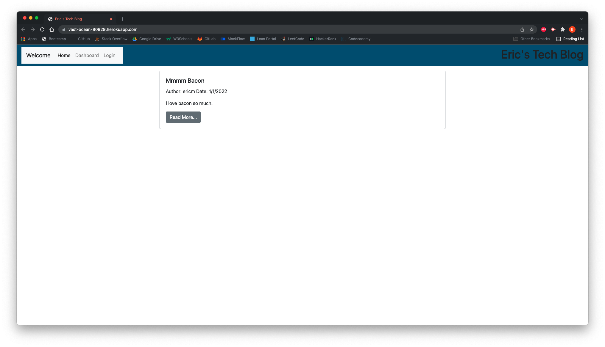

# Tech Blog
  

  ## Description
  A blog that is to be a hub of technology and web development information for developers and coders to have a place to share information about technical concepts, recent advancements, and new technologies. Visitors to the site are able to read and digest the work of others, and if they so wish, can become members and create posts and contribute to the conversation of their community.
  ## Table of Contents
  * [Installation](#installation)
  * [Usage](#usage)
  * [License](#license)
  * [Questions](#questions)
  ## Installation
  Navigate to github.com/emthedm/tech-blog and clone the repo. Make sure NPM is installed and perform a npm i on the integrated terminal. Make sure you are logged into MySQL, then SOURCE the schema.sql file. Perform npm run seed and finally node server.js.
  ## Usage
  Navigate to https://vast-ocean-80929.herokuapp.com/ to use app.

  
  ## License
      This project is licensed under MIT.
  ## Questions
  If you would like to connect with the developer about Tech Blog, please email them at eric_martin@me.com or their gitHub at @EMtheDM.
